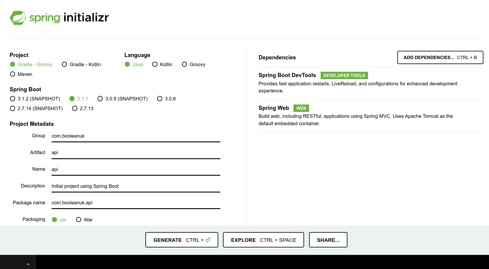

# Java API Counter Workshop

## Learning Objectives
- Use Spring Boot Web to build a simple API
- Use RestController classes to map HTTP requests to class methods

## Instructions

1. Fork this repository
2. Clone your fork to your machine
3. Open the project in IntelliJ
4. After building the project, run the `Main` class and use `http://localhost:4000` to test your route implementations

## Getting Started with Spring

Spring is a framework of libraries and services which allow us to do a huge amount of things with Java without having to write our own libraries. It is well worth spending time learning about the many different things Spring can do and building your own projects based on Spring to learn about its capabilities once the course is over. Although we are going to make use of Spring Boot we are barely going to scratch the surface of what you can do with the framework as a whole. There is an overview here: [https://en.wikipedia.org/wiki/Spring_Framework](https://en.wikipedia.org/wiki/Spring_Framework) that may give you some insights into what it can do.

This repo is already configured to allow you to create a simple API based app using Spring, but it is worth going through the steps to get to this point, to show you how easy it is to get started.

To create a new Spring Boot project which we can use with IntelliJ (or any other Java IDE) we start by going to the Spring Initializr here: [https://start.spring.io](https://start.spring.io/). You should see something like the following window, change your settings to match this and click on **Generate** to download the new project.



Unzip the resulting file where you want the project to live, rename the folder to something sensible and open the folder as a new project in IntelliJ, once Gradle Sync has completed you will be good to go. The versions in this repo are slightly older than the ones in the new project but both should work equally as well.

You can delete the ApiApplication.java file and make a new Main class in the same package which is where we'll create our initial code, that will tell Java that we're using Spring and to initialise things accordingly.

We're going to build a very simple web based joke machine, when we run the program and go to the correct page to begin with we'll get a random joke sent as plain text which the browser will display. Once we have that working we'll add in some other paths that will result in different data coming back from the "server" (aka the Java program you are writing and will have running on the machine).

You can do the next steps either in this repo or in your new project that you've created using the Spring Intitializr.

Create a new class called `Main` and add the following code to it.

```java
package com.booleanuk.api;

import org.springframework.boot.SpringApplication;
import org.springframework.boot.autoconfigure.SpringBootApplication;

@SpringBootApplication
public class Main {
    public static void main(String[] args) {
        SpringApplication.run(Main.class, args);
    }    
}
```

This tells Java that we are running a `SpringBootApplication` when the `main` method is run, and to pass in the `Main` class so that it will work correctly. If we run this code now although it will run and start listening on port 4000, we won't actually see anything when we go there, as we need to write some code to allow Spring Boot to serve content when the webpage is accessed.

## Serving our first joke

We're going to make it so that when we access http://localhost:4000 (ie port 4000 on the local machine) a joke is returned, which will be displayed in the browser.

> What sort of car does an egg drive?
> 
> A yolkswagen.

Let's create a class called JokeMachine with a `joke` field.

```java
package com.booleanuk.api;

public class JokeMachineController {
    private String joke;
    
    public JokeMachineController() {
        this.joke = "What sort of car does an egg drive? - A yolkswagen!!!";
    }   
}
```
 
At the moment this won't do anything as Spring Boot doesn't know anything about this class or its contents. To change that we need to add a method which will return the `joke` and then we'll start adding annotations. Add the following method to the class.

```java
    public String getJoke() {
        return this.joke;
    }
```

Annotate the class and methods as follows (and add the import statements if they don't get added automatically by IntelliJ).

```java
package com.booleanuk.api;

import org.springframework.web.bind.annotation.GetMapping;
import org.springframework.web.bind.annotation.RestController;

@RestController
public class JokeMachineController {
    private String joke;

    public JokeMachineController() {
        this.joke = "What sort of car does an egg drive? - A yolkswagen!!!";
    }

    @GetMapping("/jokes")
    public String getJoke() {
        return this.joke;
    }
}
```

Run the program and assuming it starts successfully, open [http://localhost:4000/jokes](http://localhost:4000/jokes) in your browser. You should see the joke displayed in all its glory in the browser. The first annotation `@RestController` tells Spring Boot that the class is going to be an endpoint, for requests that will be made via the web. The second annotation `@GetMapping("/jokes")` tells Spring Boot that when it gets a web request (using `get`) that matches the base URL for the site plus `/jokes` at the end (so http://localhost:4000/jokes in our case) then this method (`getJoke`) will return the data that should be sent back in response.
 
Since we are going to add other routes to our code, but they will all be based on `/jokes` as the base URL we can make it simpler by moving that route to the top of the class and then using the remainder of the route (as applicable) to annotate the methods. Modify the class as follows and the rerun it.

```java
package com.booleanuk.api;

import org.springframework.web.bind.annotation.GetMapping;
import org.springframework.web.bind.annotation.RequestMapping;
import org.springframework.web.bind.annotation.RestController;

@RestController
@RequestMapping("/jokes")
public class JokeMachineController {
    private String joke;

    public JokeMachineController() {
        this.joke = "What sort of car does an egg drive? - A yolkswagen!!!";
    }

    @GetMapping
    public String getJoke() {
        return this.joke;
    }
}
```

## Exercise

In your pair, find a load more jokes, change the code so that you have multiple jokes stored and then when you access the endpoint, a random joke is chosen and that is the one which is returned to the browser. Paste your code into the #code-examples channel.

## Adding further routes

We want to make it so that our program returns the number of jokes in our collection if we visit http://localhost:4000/jokes/number and that we can get to an individual joke if we go to http://localhost:4000/jokes/joke/{id} where {id} is a number corresponding to the index of a joke in the array or ArrayList we're using to store the jokes. Let's assume that we have an ArrayList of jokes and that we've added a number of jokes to it, then we can implement the first of the above steps by doing:

```java
package com.booleanuk.api;

import org.springframework.web.bind.annotation.GetMapping;
import org.springframework.web.bind.annotation.RequestMapping;
import org.springframework.web.bind.annotation.RestController;

import java.util.ArrayList;
import java.util.Random;

@RestController
@RequestMapping("/jokes")
public class JokeMachineController {
    private ArrayList<String> jokes;
    Random rand;

    public JokeMachineController() {
        this.jokes = new ArrayList<>();
        this.jokes.add("What sort of car does an egg drive? - A yolkswagen!!!");
        this.jokes.add("What's the best thing about Switzerland? - I don't know, but the flag is a big plus.");
        this.jokes.add("What has more letters than the alphabet? - The post office!");
        this.jokes.add("How do you make 7 even? - Take away the s!");
        this.jokes.add("I used to be addicted to soap, but I'm clean now.");
        this.jokes.add("A guy walked into a bar... and was disqualified from the limbo contest.");
        this.rand = new Random();
    }

    @GetMapping
    public String getJoke() {
        return this.jokes.get(this.rand.nextInt(this.jokes.size()));
    }

    @GetMapping("/number")
    public int numberOfJokes() {
        return this.jokes.size();
    }
}
```

Going to http://localhost:4000/jokes/number should show you the number of jokes you have.

To make it so that we can access a specific joke we need to be able to pass in a number as part of the URL, which is then treated as a variable. We can do that as follows:

```java
package com.booleanuk.api;

import org.springframework.web.bind.annotation.GetMapping;
import org.springframework.web.bind.annotation.PathVariable;
import org.springframework.web.bind.annotation.RequestMapping;
import org.springframework.web.bind.annotation.RestController;

import java.util.ArrayList;
import java.util.Random;

@RestController
@RequestMapping("/jokes")
public class JokeMachineController {
    private ArrayList<String> jokes;
    Random rand;

    public JokeMachineController() {
        this.jokes = new ArrayList<>();
        this.jokes.add("What sort of car does an egg drive? - A yolkswagen!!");
        this.jokes.add("What's the best thing about Switzerland? - I don't know, but the flag is a big plus.");
        this.jokes.add("What has more letters than the alphabet? - The post office!");
        this.jokes.add("How do you make 7 even? - Take away the s!");
        this.jokes.add("I used to be addicted to soap, but I'm clean now.");
        this.jokes.add("A guy walked into a bar... and was disqualified from the limbo contest.");
        this.rand = new Random();
    }

    @GetMapping
    public String getJoke() {
        return this.jokes.get(this.rand.nextInt(this.jokes.size()));
    }

    @GetMapping("/number")
    public int numberOfJokes() {
        return this.jokes.size();
    }

    @GetMapping("/number/{index}")
    public String getSpecificJoke(@PathVariable (name = "index") int index) {
        return this.jokes.get(index);
    }
}
```

Choosing the index of one of the existing jokes should now result in it being displayed, however if the index is too big (10 for instance) you would get an error.

We can fix this by checking the number being passed in and returning a message if it is not a valid index into the ArrayList

```java
    @GetMapping("/number/{index}")
    public String getSpecificJoke(@PathVariable (name = "index") int index) {
        if (index >= this.jokes.size()) {
            return "I'm sorry please choose a smaller number.";
        }
        return this.jokes.get(index);
    }
```

Is one solution.

## Exercise

Add a new class and routes to serve up Knock-knock jokes - I'm not sure if these are specific to English or if they are common in other languages/cultures too, so I'll go through them before you attempt this.

> Knock, knock.
> 
> Who's there?
> 
> Boo
> 
> Boo who?
> 
> Don't cry it's just a joke

Core: You should have a number of knock-knock jokes available that will be selected by supplying the specific index, this should display the first line of the joke, you would then get the next line by adding `/line2` which would display lines 1 and 2, then add `/line3` to the end to display the first 3 lines and so on until you get to the end of the joke.

Extension 1: Can you make it so that you can get the knock-knock jokes to display line by line for a randomly chosen joke?

Extension 2: Use the Spring Boot documentation/Internet searches to investigate adding a custom Error route rather than the existing "White Label" error page that displays when the URL is not one that your application is supplying as a route.


